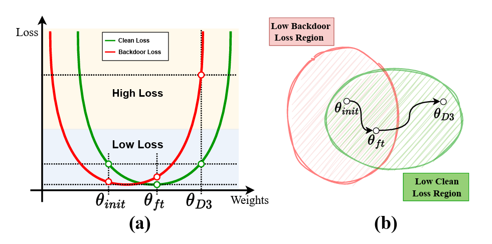

# SBackdoor mitigation by distance-driven detoxification

---

## 📊 Overview

Backdoor attacks undermine the integrity of machine learning models by allowing attackers to manipulate predictions using poisoned training data. Such attacks lead to targeted misclassification when specific triggers are present, while the model behaves normally under other conditions. This paper considers a post-training backdoor defense task, aiming to detoxify the backdoors in pre-trained models. We begin by analyzing the underlying issues of vanilla fine-tuning and observe that it is often trapped in regions with low loss for both clean and poisoned samples. Motivated by such observations, we propose Distance-Driven Detoxification (D3), an innovative approach that reformulates backdoor defense as a constrained optimization problem. Specifically, D3 promotes the model's departure from the vicinity of its initial weights, effectively reducing the influence of backdoors. Extensive experiments on state-of-the-art (SOTA) backdoor attacks across various model architectures and datasets demonstrate that D3 not only matches but often surpasses the performance of existing SOTA post-training defense techniques.



---

## 🛠️ Setup Instructions

To start working with this project:

1. **Clone Repository**:
    ```bash
    git clone https://github.com/shawkui/Distance_Driven_Detoxification.git
    cd Distance_Driven_Detoxification
    ```

2. **Install Dependencies**:
    ```bash
    bash sh/install.sh
    ```

---

## ⚙️ Usage

### 🧪 Performing an Attack

Simulate an attack scenario using the command:
```bash
python attack/badnet.py --save_folder_name badnet_demo
```

### 🛡️ Applying SAU Defense Mechanism

After setting up the attack scenario, apply the SAU defense with:
```bash
python defense/d3.py --result_file badnet_demo
```

---

## 📄 Citation

If you find our work valuable and use it in your research, please cite our paper using the following BibTeX entry:

```bibtex
@inproceedings{wei2025backdoor,
  title={Backdoor mitigation by distance-driven detoxification},
  author={Wei, Shaokui and Liu, Jiayin and Zha, Hongyuan},
  booktitle={Proceedings of the IEEE/CVF International Conference on Computer Vision},
  pages={4465--4474},
  year={2025}
}
```

---

## 🎖️ Acknowledgment

Our code is built upon [BackdoorBench](https://github.com/SCLBD/BackdoorBench), *"BackdoorBench: A Comprehensive Benchmark of Backdoor Learning"*. If you find their work useful, consider giving them a star.

---

## 📞 Contact

For any inquiries or feedback, feel free to open an issue or reach out via email at `shaokuiwei@link.cuhk.edu.cn`.

---
